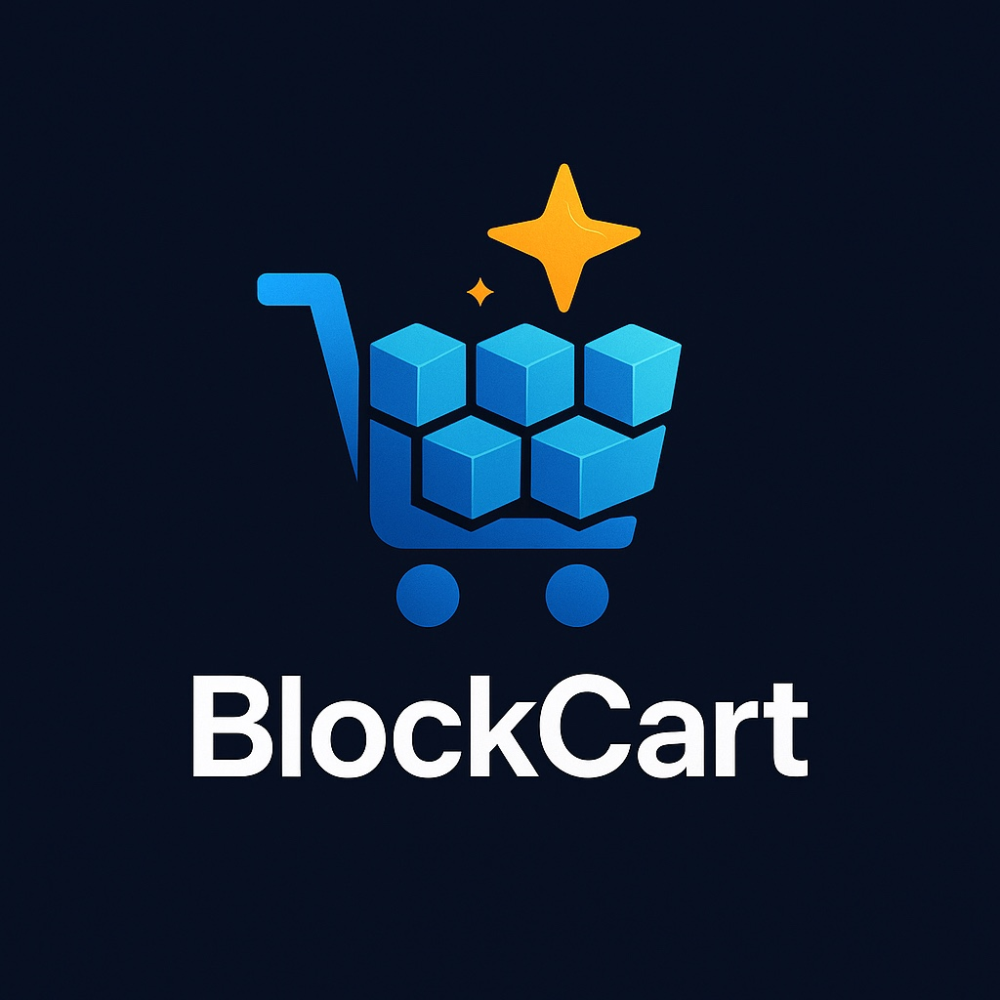

<div align="center">
  
</div>

# Blockcart - Receipt Rewards Platform

A comprehensive full-stack receipt rewards application that enables users to upload receipts, earn rewards, and allows administrators to manage the platform through a powerful web interface. Built with React Native, Next.js, and Supabase.

## 🚪 Accessing the Applications

### Mobile App (Expo Go)

**Download & Open:**
1. Install **Expo Go** from the [App Store](https://apps.apple.com/app/expo-go/id982107779) (iOS) or [Google Play](https://play.google.com/store/apps/details?id=host.exp.exponent) (Android)
2. Open the link `https://expo.dev/preview/update?message=Add+expo-file-system+dependency+and+enhance+image+upload+handling%0A%0A-+Introduced+%60expo-file-system%60+to+%60package.json%60+and+%60packag&updateRuntimeVersion=1.0.0&createdAt=2025-10-29T15%3A48%3A22.331Z&slug=exp&projectId=d4acf625-87e2-43b2-9723-92f64d1fbacb&group=7026e5c1-8b9d-4978-9865-0230c7e051c2`

**Login Credentials:**
- New users can create an account directly in the app
- For demo accounts, use email:`mobile@mail.com` and password `123456`

### Admin Dashboard (Web)

**Access:**
- **URL**: https://blockcart.vercel.app/
- Open the link in any modern web browser

**Login Credentials:**
- **Email**:  `admin@mail.com` or `reviewer@mail.com`
- **Password**: `123456`


## 🌟 Overview

Blockcart transforms everyday shopping into reward opportunities. Users can upload receipts from their purchases, earn USDT$ tokens, participate in promotional campaigns, and refer friends to build a community of rewarded shoppers. Administrators have full control through a modern dashboard to manage users, review receipts, create campaigns, and analyze platform performance.

### Platform Components

- **📱 Mobile App** (`expo-blockcart/`): React Native app for users to upload receipts and track rewards
- **🖥️ Admin Dashboard** (`next-blockcart/`): Next.js web application for platform administration
- **⚙️ Backend** (`supabase-backend/`): Supabase infrastructure with database, Edge Functions, and API

## 🎯 Key Features

### For Users (Mobile App)
- **Receipt Upload**: Capture or select receipt images with automatic OCR processing
- **Reward System**: Earn USDT$ tokens for approved receipts
- **Campaign Participation**: Automatic enrollment in promotional campaigns
- **Referral Program**: Invite friends and earn referral bonuses
- **Wallet Management**: Track earnings and connect Solana wallet for withdrawals
- **Real-time Notifications**: Get notified about receipt status and new campaigns
- **Receipt History**: View all submitted receipts with detailed status tracking

### For Administrators (Dashboard)
- **Receipt Review**: Review, approve, or reject receipt submissions
- **User Management**: View and manage user accounts and roles
- **Campaign Management**: Create and manage reward campaigns with rule builder and templates
- **Reward Tracking**: Monitor reward distribution and user balances
- **Referral Management**: Track referral relationships and commissions
- **Analytics**: Comprehensive analytics dashboard with charts and reports
- **Role-Based Access**: Separate admin and reviewer roles with appropriate permissions

### For Developers
- **Type-Safe**: Built with TypeScript across all components
- **Modern Stack**: React Native, Next.js 15, Supabase
- **Comprehensive Error Handling**: User-friendly error messages and logging
- **Scalable Architecture**: Serverless Edge Functions and managed database
- **Security First**: Row Level Security (RLS) and role-based access control

## 🏗️ Project Architecture

```
blockcart/
├── 📱 expo-blockcart/      # React Native mobile app
│   ├── src/
│   │   ├── components/    # Reusable UI components
│   │   ├── screens/       # App screens
│   │   ├── hooks/         # Custom React hooks
│   │   ├── lib/           # Utilities and services
│   │   ├── navigation/    # Navigation setup
│   │   ├── context/       # React context providers
│   │   └── theme/         # Theme configuration
│   └── package.json
├── 🖥️ next-blockcart/      # Next.js admin dashboard
│   ├── app/               # Next.js 13+ app router
│   │   ├── dashboard/     # Admin dashboard pages
│   │   ├── login/         # Authentication
│   │   └── layout.tsx     # Root layout
│   ├── components/        # Reusable components
│   ├── hooks/             # Custom React hooks
│   ├── lib/               # Utilities and services
│   └── middleware.ts      # Auth middleware
└── ⚙️ supabase-backend/    # Backend infrastructure
    ├── database/          # SQL migrations and schema
    │   ├── migrations/    # Database migration files
    │   ├── schema.sql     # Main database schema
    │   └── views.sql      # Database views
    └── edge-functions/    # Serverless functions
        ├── ocr-parser.ts           # OCR processing
        ├── upload-receipt.ts       # Receipt upload handling
        ├── review-handler.ts       # Receipt review workflow
        ├── reward-handler.ts       # Reward distribution
        ├── invite-reviewer.ts      # Reviewer invitations
        ├── admin-settings.ts       # Admin configuration
        └── analytics-dashboard.ts  # Analytics aggregation
```

## 🚀 Quick Start

### Prerequisites

- **Node.js** 18+ installed
- **Supabase Account** with a project set up
- **Git** for version control
- **Expo CLI** (for mobile app development): `npm install -g @expo/cli`
- **Supabase CLI** (for backend development): `npm install -g supabase`

### 1. Set Up the Backend (Required First)

The backend must be set up before running any applications.

```bash
# Navigate to backend directory
cd supabase-backend/

# Follow the detailed setup instructions in supabase-backend/README.md
# This includes:
# - Deploying database schema
# - Setting up Edge Functions
# - Configuring Row Level Security (RLS)
```

**⏱️ Estimated time**: 15-20 minutes

**📖 Full Instructions**: See [supabase-backend/README.md](supabase-backend/README.md)

### 2. Set Up the Mobile App

```bash
# Navigate to mobile app directory
cd expo-blockcart/

# Install dependencies
npm install

# Create .env file with Supabase credentials
# EXPO_PUBLIC_SUPABASE_URL=your_supabase_project_url
# EXPO_PUBLIC_SUPABASE_ANON_KEY=your_supabase_anon_key

# Follow detailed setup in expo-blockcart/README.md
```

**📖 Full Instructions**: See [expo-blockcart/README.md](expo-blockcart/README.md)

### 3. Set Up the Admin Dashboard

```bash
# Navigate to admin dashboard directory
cd next-blockcart/

# Install dependencies
npm install

# Create .env.local file with Supabase credentials
# NEXT_PUBLIC_SUPABASE_URL=your_supabase_project_url
# NEXT_PUBLIC_SUPABASE_ANON_KEY=your_supabase_anon_key
# SUPABASE_SERVICE_ROLE_KEY=your_service_role_key

# Follow detailed setup in next-blockcart/README.md
```

**📖 Full Instructions**: See [next-blockcart/README.md](next-blockcart/README.md)

## 🏃 Running the Applications

### Start All Applications

You'll need three terminal windows:

**Terminal 1 - Backend** (Supabase Edge Functions)

   ```bash
   cd supabase-backend/
# Functions are deployed to Supabase cloud
# For local development:
supabase functions serve
   ```

**Terminal 2 - Mobile App**

   ```bash
   cd expo-blockcart/
   npm start
   # Opens Expo Dev Tools at http://localhost:19006
   # Scan QR code with Expo Go app
   ```

**Terminal 3 - Admin Dashboard**

   ```bash
   cd next-blockcart/
   npm run dev
   # Opens admin dashboard at http://localhost:3000
   ```

### Access Points

- **📱 Mobile App**: Scan QR code in Expo Dev Tools or use Expo Go app
- **🖥️ Admin Dashboard**: http://localhost:3000
- **🔧 Supabase Dashboard**: https://supabase.com/dashboard (manage your project)

## 👥 User Guide

### For End Users (Mobile App)

Blockcart makes earning rewards from your shopping receipts simple and straightforward.

#### Getting Started as a User

1. **Download & Install**
   - Install Expo Go from App Store or Google Play
   - Or download the native app when available

2. **Create Account**
   - Open the app
   - Tap "Create Account"
   - Enter your email and create a password
   - Complete registration

3. **Upload Your First Receipt**
   - Tap the "Upload" button on the home screen
   - Choose to take a photo or select from gallery
   - Ensure the receipt is clear and readable
   - Confirm upload
   - Wait for processing (usually takes a few seconds)

#### Earning Rewards

**How It Works:**
1. **Upload Receipts**: Submit up to 2 receipts per day
2. **Automatic Processing**: OCR extracts data from your receipt
3. **Review Process**: Administrators verify your receipts
4. **Receive Rewards**: Approved receipts add USDT$ to your wallet
5. **Campaign Bonuses**: Automatic bonuses during active campaigns

**Tips for Success:**
- Take clear, well-lit photos of receipts
- Ensure entire receipt is visible
- Upload receipts promptly after purchase
- Check for active campaigns before uploading

#### Managing Your Account

**Profile Management:**
- Update personal information (name, age, location)
- Connect Solana wallet for withdrawals
- View account statistics and history

**Wallet & Rewards:**
- View total balance in USDT$
- See transaction history
- Track receipt statuses
- Monitor reward earnings

**Referral Program:**
- Share your unique referral code
- Earn bonuses when friends sign up
- Track referral earnings
- View referral activity

#### Understanding Receipt Status

- **Pending**: Receipt is being processed
- **Pending Review**: Awaiting administrator review
- **Approved**: Verified and rewards added to wallet
- **Rejected**: Doesn't meet requirements (with reason)
- **Flagged**: Requires additional verification
- **Error**: Processing failed (can retry)

**📱 Full Mobile App Guide**: See [expo-blockcart/README.md](expo-blockcart/README.md#user-guide)

### For Administrators (Dashboard)

Manage the Blockcart platform efficiently through the comprehensive admin dashboard.

#### Getting Started as an Administrator

1. **Access Dashboard**
   - Navigate to your dashboard URL (typically `https://yourdomain.com/dashboard`)
   - You'll be redirected to login if not authenticated

2. **First Login**
   - Use credentials set up in Supabase
   - Ensure your account has `admin` role in `web_users` table

3. **Dashboard Overview**
   - View platform statistics at a glance
   - Monitor recent receipts and activity
   - Access all management sections

#### Managing Receipts

**Review Process:**
1. Navigate to **Receipts** in sidebar
2. View pending receipts requiring review
3. Click on a receipt to view details:
   - Receipt image
   - OCR extracted data
   - User information
   - Submission metadata
4. Make decision:
   - **Approve**: User receives rewards
   - **Reject**: Provide rejection reason
   - **Flag**: Mark for additional review

**For Reviewers:**
- Reviewers see assigned receipts in their queue
- Focus on receipts requiring action
- Cannot access admin-only features

#### Creating Campaigns

**Campaign Creation:**
1. Navigate to **Campaigns**
2. Click **"Create Campaign"**
3. **Choose Template** (optional):
   - Double Rewards Weekend
   - Grocery Basket Bonus
   - Referral Boost
4. **Configure Settings**:
   - Name, description, dates
   - Reward type and amount
   - Eligibility rules
5. **Preview Eligibility**: See how many users qualify
6. **Save Campaign**

**Campaign Types:**
- **Multiplier Campaigns**: Multiply base rewards (e.g., 2x)
- **Fixed Bonuses**: Additional fixed amount per receipt
- **Store-Specific**: Bonuses for specific merchants
- **Referral Boosts**: Extra rewards for referral relationships

#### Managing Users

**User Overview:**
- View all registered users
- See user statistics (receipts, rewards, activity)
- Filter and search users

**User Details:**
- View comprehensive user profile
- See receipt history
- Check reward history
- Monitor referral activity
- View activity timeline

#### Analytics & Reporting

**Analytics Dashboard:**
- Platform-wide metrics
- Receipt submission trends
- Reward distribution analysis
- User growth tracking
- Campaign performance
- Store category breakdown

**Reports:**
- Export data as CSV
- Generate custom reports
- Download visualizations
- Schedule automated reports

#### Platform Settings

**Configuration:**
- Enable/disable maintenance mode
- Configure reviewer invitations
- Set notification preferences
- Manage system alerts

**Reviewer Management:**
- Invite new reviewers
- Manage reviewer access
- View pending invitations
- Monitor reviewer activity

**🖥️ Full Admin Dashboard Guide**: See [next-blockcart/README.md](next-blockcart/README.md#user-guide)

## 🔧 Configuration & Environment Variables

Each application requires specific environment variables:

### Mobile App (`.env`)

```env
EXPO_PUBLIC_SUPABASE_URL=your_supabase_project_url
EXPO_PUBLIC_SUPABASE_ANON_KEY=your_supabase_anon_key
```

### Admin Dashboard (`.env.local`)

```env
NEXT_PUBLIC_SUPABASE_URL=your_supabase_project_url
NEXT_PUBLIC_SUPABASE_ANON_KEY=your_supabase_anon_key
SUPABASE_SERVICE_ROLE_KEY=your_service_role_key
```

### Backend (Supabase Dashboard Settings)

Edge Functions may require secrets configured in Supabase Dashboard:
- OCR service API keys
- Email service credentials
- Other third-party service keys

Get Supabase credentials from **Settings > API** in your Supabase Dashboard.

## 🗄️ Database Schema

The application uses the following main entities:

- **`users`**: Mobile app users (managed by Supabase Auth)
- **`receipts`**: User-submitted receipts with OCR data
- **`web_users`**: Admin dashboard users with roles
- **`campaigns`**: Reward campaigns and rules
- **`rewards`**: User reward balances and history
- **`referrals`**: Referral tracking and commissions
- **`reviewer_notifications`**: Notifications for reviewers
- **`receipt_assignments`**: Receipt-to-reviewer assignments

See `supabase-backend/database/schema.sql` for the complete schema.

## 🔐 Authentication & Authorization

### Mobile App Users

- **Authentication**: Supabase Auth (email/password)
- **Registration**: Automatic on first app launch
- **Session Management**: JWT tokens stored securely
- **Data Access**: Users can only access their own data (RLS)

### Admin Dashboard Users

- **Authentication**: Supabase Auth with role-based access
- **Roles**: `admin`, `reviewer`
- **Permissions**: 
  - **Admin**: Full access to all features
  - **Reviewer**: Limited to receipt review only
- **Session Management**: JWT tokens in httpOnly cookies
- **Route Protection**: Middleware validates sessions and roles

### Creating Admin Accounts

**Via SQL:**
```sql
INSERT INTO web_users (id, email, role, created_at)
VALUES (gen_random_uuid(), 'admin@example.com', 'admin', NOW());
```

Then create the user in Supabase Authentication with the same email.

## 📋 Development Workflow

### For Mobile App Development

1. **Make changes** in `expo-blockcart/src/`
2. **Test on device** using Expo Go app
3. **Debug** using React Native Debugger or console logs
4. **Build for production** with `npx expo build`

**📖 Full Guide**: [expo-blockcart/README.md](expo-blockcart/README.md)

### For Admin Dashboard Development

1. **Make changes** in `next-blockcart/`
2. **Test in browser** at http://localhost:3000
3. **Debug** using browser dev tools
4. **Deploy** to Vercel or your hosting platform

**📖 Full Guide**: [next-blockcart/README.md](next-blockcart/README.md)

### For Backend Development

1. **Modify Edge Functions** in `supabase-backend/edge-functions/`
2. **Test locally** with `supabase functions serve`
3. **Deploy** with `supabase functions deploy`
4. **Monitor** through Supabase Dashboard

**📖 Full Guide**: [supabase-backend/README.md](supabase-backend/README.md)

## 🚨 Troubleshooting

### Common Issues

1. **"Permission denied" errors**
   - Ensure RLS policies are properly configured
   - Check that users exist in correct tables
   - Verify API keys are correct

2. **Edge Functions not working**
   - Verify functions are deployed to Supabase
   - Check function logs in Supabase Dashboard
   - Ensure environment variables are set

3. **Mobile app can't connect**
   - Verify Supabase credentials in `.env` file
   - Check network connectivity
   - Ensure backend is properly set up

4. **Admin dashboard login fails**
   - Ensure user exists in `web_users` table
   - Verify user role is set correctly
   - Check Supabase authentication is working

5. **Receipt processing errors**
   - Check OCR service configuration
   - Verify receipt image format and size
   - Review Edge Function logs

### Getting Help

- 📖 **Read the README files** in each directory for detailed instructions
- 🔍 **Check Supabase logs** in your dashboard for errors
- 🐛 **Debug with browser dev tools** for frontend issues
- 📧 **Review Edge Function logs** for backend issues
- 💬 **Check the Issues** section in the repository

## 📁 Project Structure Summary

```
blockcart/
├── 📱 expo-blockcart/           # React Native mobile app
│   ├── src/
│   │   ├── components/         # Reusable UI components
│   │   ├── screens/           # App screens
│   │   ├── hooks/             # Custom React hooks
│   │   ├── lib/               # Utilities and services
│   │   └── navigation/        # Navigation setup
│   ├── assets/                # Images and icons
│   └── README.md              # Mobile app documentation
├── 🖥️ next-blockcart/           # Next.js admin dashboard
│   ├── app/                   # Next.js 13+ app router
│   ├── components/            # Reusable components
│   ├── hooks/                 # Custom React hooks
│   ├── lib/                   # Utilities and services
│   └── README.md              # Dashboard documentation
├── ⚙️ supabase-backend/         # Backend infrastructure
│   ├── database/              # SQL migrations and schema
│   ├── edge-functions/        # Serverless functions
│   └── README.md              # Backend documentation
└── 📚 README.md                 # This file
```

## 🤝 Contributing

We welcome contributions! Here's how to get started:

1. **Fork** the repository
2. **Create** a feature branch (`git checkout -b feature/amazing-feature`)
3. **Make changes** following existing code style
4. **Test thoroughly** across all applications
5. **Commit** your changes (`git commit -m 'Add amazing feature'`)
6. **Push** to your branch (`git push origin feature/amazing-feature`)
7. **Submit** a pull request

### Development Guidelines

- **Code Style**: Follow existing patterns and conventions
- **TypeScript**: Use proper types throughout
- **Testing**: Test all features across mobile and web platforms
- **Documentation**: Update README files for new features
- **Security**: Ensure RLS policies are maintained
- **Error Handling**: Use consistent error handling patterns

## 📄 License

This project is licensed under the MIT License - see the LICENSE file for details.

## 🙏 Acknowledgments

- **Supabase** for the amazing backend platform and tools
- **Expo** for the excellent React Native development experience
- **Next.js** for the powerful React framework
- **Vercel** for deployment and hosting
- **Open Source Community** for the incredible tools and libraries

## 📚 Documentation Links

- **Mobile App**: [expo-blockcart/README.md](expo-blockcart/README.md)
- **Admin Dashboard**: [next-blockcart/README.md](next-blockcart/README.md)
- **Backend**: [supabase-backend/README.md](supabase-backend/README.md)
- **Supabase Docs**: https://supabase.com/docs
- **Expo Docs**: https://docs.expo.dev
- **Next.js Docs**: https://nextjs.org/docs

---

**Happy coding! 🎉**

For specific feature documentation, refer to the README files in each subdirectory.
